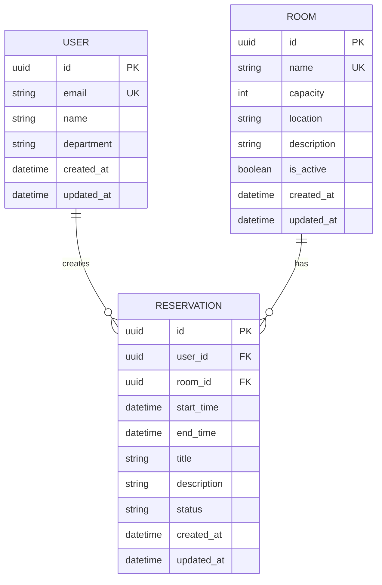

# ERD (Entity Relationship Diagram)

## 다이어그램

## 엔티티 설명

### USER
- SSO 인증을 통해 생성되는 사용자 정보
- 예약 생성/수정/삭제의 주체

### ROOM
- 예약 가능한 회의실 정보
- 관리자에 의해 등록/관리

### RESERVATION
- 사용자의 회의실 예약 정보
- 시간 충돌 검증 필요

## 관계

| 관계 | 설명 |
|------|------|
| USER - RESERVATION | 1:N, 한 사용자는 여러 예약을 생성할 수 있음 |
| ROOM - RESERVATION | 1:N, 한 회의실에 여러 예약이 있을 수 있음 |
