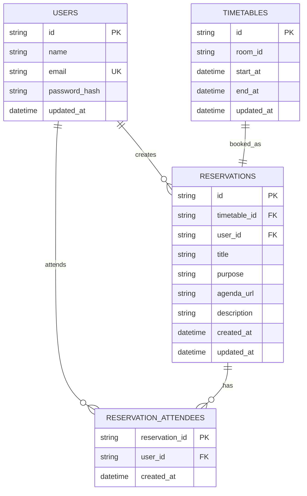

# ERD (Entity Relationship Diagram)

- Revision Date: 2026-02-20
- Version: v1

## 다이어그램

## 엔티티 설명

### `users`
- 로그인/인증 주체
- 예약 생성자(`reservations.user_id`) 및 참석자(`reservation_attendees.user_id`)로 참조됨
- `email`은 unique, 비밀번호는 `password_hash`로 저장

### `timetables`
- 회의실 시간 슬롯 단위 테이블
- `room_id + start_at + end_at` 유니크 제약으로 동일 슬롯 중복 방지
- `end_at > start_at` 체크 제약 포함

### `reservations`
- 실제 예약 정보
- `timetable_id` unique로 슬롯당 예약 1건 보장
- 회의 목적(`purpose`), 안건 링크(`agenda_url`) 저장 가능

### `reservation_attendees`
- 예약-사용자 N:M 조인 테이블
- 복합 PK(`reservation_id`, `user_id`)로 중복 참석자 방지

## 관계

| 관계 | 설명 |
|------|------|
| `users` - `reservations` | 1:N, 한 사용자는 여러 예약을 생성할 수 있음 |
| `timetables` - `reservations` | 1:1(예약 관점), 슬롯(`timetable_id`)당 예약 1건 |
| `reservations` - `reservation_attendees` | 1:N, 예약 1건에 여러 참석자 연결 |
| `users` - `reservation_attendees` | 1:N, 한 사용자가 여러 예약에 참석 가능 |

## 비고

- `room_id`는 현재 DB FK가 아니라 도메인 값으로 사용한다.
- 화면용 `room_name`(예: 대회의실, 테이블)은 매핑으로 반환한다.
