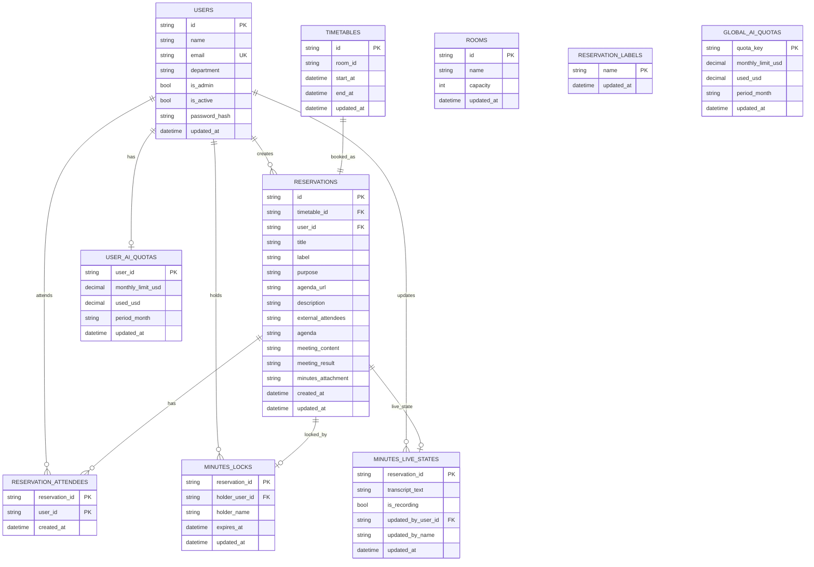

# ERD (Entity Relationship Diagram)

- Revision Date: 2026-04-21
- Version: v2

## 다이어그램

```mermaid
erDiagram
    USERS ||--o{ RESERVATIONS : creates
    USERS ||--o{ RESERVATION_ATTENDEES : attends
    USERS ||--o| USER_AI_QUOTAS : has
    USERS ||--o{ MINUTES_LOCKS : holds
    USERS ||--o{ MINUTES_LIVE_STATES : updates
    TIMETABLES ||--|| RESERVATIONS : booked_as
    RESERVATIONS ||--o{ RESERVATION_ATTENDEES : has
    RESERVATIONS ||--o| MINUTES_LOCKS : locked_by
    RESERVATIONS ||--o| MINUTES_LIVE_STATES : live_state

    ROOMS {
        string id PK
        string name
        int capacity
        datetime updated_at
    }

    USERS {
        string id PK
        string name
        string email UK
        string department
        bool is_admin
        bool is_active
        string password_hash
        datetime updated_at
    }

    TIMETABLES {
        string id PK
        string room_id
        datetime start_at
        datetime end_at
        datetime updated_at
    }

    RESERVATIONS {
        string id PK
        string timetable_id FK
        string user_id FK
        string title
        string label
        string purpose
        string agenda_url
        string description
        string external_attendees
        string agenda
        string meeting_content
        string meeting_result
        string minutes_attachment
        datetime created_at
        datetime updated_at
    }

    RESERVATION_ATTENDEES {
        string reservation_id PK
        string user_id PK
        datetime created_at
    }

    RESERVATION_LABELS {
        string name PK
        datetime updated_at
    }

    MINUTES_LOCKS {
        string reservation_id PK
        string holder_user_id FK
        string holder_name
        datetime expires_at
        datetime updated_at
    }

    MINUTES_LIVE_STATES {
        string reservation_id PK
        string transcript_text
        bool is_recording
        string updated_by_user_id FK
        string updated_by_name
        datetime updated_at
    }

    USER_AI_QUOTAS {
        string user_id PK
        decimal monthly_limit_usd
        decimal used_usd
        string period_month
        datetime updated_at
    }

    GLOBAL_AI_QUOTAS {
        string quota_key PK
        decimal monthly_limit_usd
        decimal used_usd
        string period_month
        datetime updated_at
    }
```

## 관계 메모

- `rooms`는 현재 다른 테이블과 DB FK로 연결되지 않고, `timetables.room_id` 도메인 키로 참조된다.
- `reservations`는 `timetable_id` unique 제약으로 타임슬롯과 1:1 연결된다.
- `reservation_attendees`는 예약-사용자 N:M 조인 테이블이다.
- `minutes_locks`, `minutes_live_states`는 예약 단위 보조 상태 테이블이다.
- `reservation_labels`는 참조 테이블이지만 `reservations.label`에 FK를 두지는 않는다.
- `global_ai_quotas`는 현재 `quota_key='global'` 단일 행을 사용하는 운영용 요약 테이블이다.
