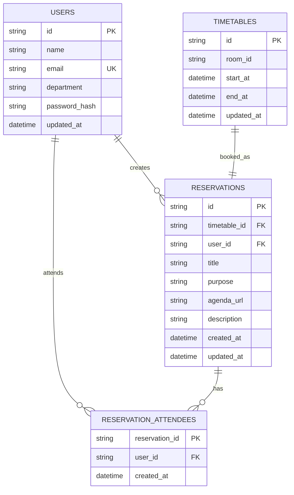

# ERD (Entity Relationship Diagram)

- Revision Date: 2026-04-06
- Version: v1

## 다이어그램

```mermaid
erDiagram
    USERS ||--o{ RESERVATIONS : creates
    USERS ||--o{ RESERVATION_ATTENDEES : attends
    TIMETABLES ||--|| RESERVATIONS : booked_as
    RESERVATIONS ||--o{ RESERVATION_ATTENDEES : has

    USERS {
        string id PK
        string name
        string email UK
        string department
        string password_hash
        datetime updated_at
    }

    TIMETABLES {
        string id PK
        string room_id
        datetime start_at
        datetime end_at
        datetime updated_at
    }

    RESERVATIONS {
        string id PK
        string timetable_id FK
        string user_id FK
        string title
        string purpose
        string agenda_url
        string description
        datetime created_at
        datetime updated_at
    }

    RESERVATION_ATTENDEES {
        string reservation_id PK
        string user_id FK
        datetime created_at
    }
```

## 엔티티 설명

### `users`
- 로그인과 권한 판별의 기준 테이블
- 예약 생성자(`reservations.user_id`) 및 참석자(`reservation_attendees.user_id`)로 참조된다
- `email`은 unique이고 `department`는 필수값이다

### `timetables`
- 회의실 시간 슬롯 단위 테이블
- `room_id + start_at + end_at` 유니크 제약으로 동일 슬롯 중복 방지
- `end_at > start_at` 체크 제약 포함

### `reservations`
- 실제 예약 메타데이터를 저장한다
- `timetable_id` unique 제약으로 한 슬롯에는 예약 1건만 연결된다
- `purpose`, `agenda_url`, `description`은 선택 입력이다

### `reservation_attendees`
- 예약-사용자 N:M 조인 테이블
- 복합 PK(`reservation_id`, `user_id`)로 중복 참석자 방지

## 관계

| 관계 | 설명 |
|------|------|
| `users` - `reservations` | 1:N, 한 사용자는 여러 예약을 생성할 수 있음 |
| `timetables` - `reservations` | 1:1(예약 관점), 슬롯(`timetable_id`)당 예약 1건 |
| `reservations` - `reservation_attendees` | 1:N, 예약 1건에 여러 참석자 연결 |
| `users` - `reservation_attendees` | 1:N, 한 사용자가 여러 예약에 참석 가능 |

## 비고

- `room_id`는 현재 DB FK가 아니라 도메인 값으로 사용한다.
- 화면용 `room_name`은 API 계층에서 매핑해 반환한다.
- 관리자 계정은 마이그레이션 seed가 아니라 서버 시작 시 보정된다.
